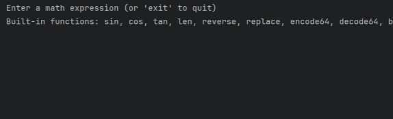

# [KExpression](https://github.com/perracodex/KExpression)
An extensible math expression evaluator in Kotlin.



### Overview
KExpression is an extensible expression evaluator written in Kotlin, supporting various types of nodes including numbers,
binary operations, functions, text literals, and unary operations.


### Usage
To use KExpression, create an instance of the Evaluator class and call the evaluate method with the expression
you want to evaluate as a string. For example:

```kotlin
val evaluator = Evaluator()
val result = evaluator.evaluate(input = "1 + 2 * sin(1)")
```

### High Level Design

KExpression works by using a combination of a lexer, parser, and evaluator to process mathematical expressions. 
Here's a brief explanation of each component:

### Lexer
The lexer, also known as the scanner or tokenizer, is the first phase of this process.
It takes the input string of characters and converts it into a list of tokens.
Each token represents a meaningful unit of information in the input.
For example, in the expression "1 + 2", the lexer would produce the tokens NUMBER(1), PLUS, and NUMBER(2).

### Parser
The parser takes the list of tokens produced by the lexer and transforms it into an abstract syntax tree (AST).
The AST represents the grammatical structure of the input.
Each node in the tree corresponds to a construct in the expression.
For example, in the expression "1 + 2", the parser might produce a tree with a PLUS node as the root,
and two NUMBER nodes as its children.

### Evaluator
The evaluator walks the AST and computes the result of the expression.
It does this by recursively visiting each node in the tree and performing the corresponding computation.
For example, when visiting a PLUS node, it would compute the sum of the values of its child nodes.
It supports various types of nodes including numbers, binary operations, functions, text literals, and unary operations.
The evaluate method takes an input string, presumably representing a mathematical expression, and returns the result of
evaluating that expression. The Evaluator class also contains methods for evaluating specific types of nodes.

### Operator precedence
This is managed in the parser phase, where the abstract syntax tree (AST) is constructed.
The structure of the AST inherently represents operator precedence.
For example, in the expression "1 + 2 * 3", the multiplication operation has higher precedence than the addition operation.
The parser would construct an AST where the multiplication operation is closer to the root than the addition operation,
reflecting its higher precedence.
In the Evaluator class, when the evaluate method walks the AST and computes the result of the expression, it inherently respects
the operator precedence due to the structure of the AST.

### Error Handling
Errors during evaluation are handled by throwing an EvalException.

### Built-in Functions
KExpression comes with some built-in functions examples for both numeric and text:
sin, cos, tan, len,
reverse, replace, encode64, decode64, and base
